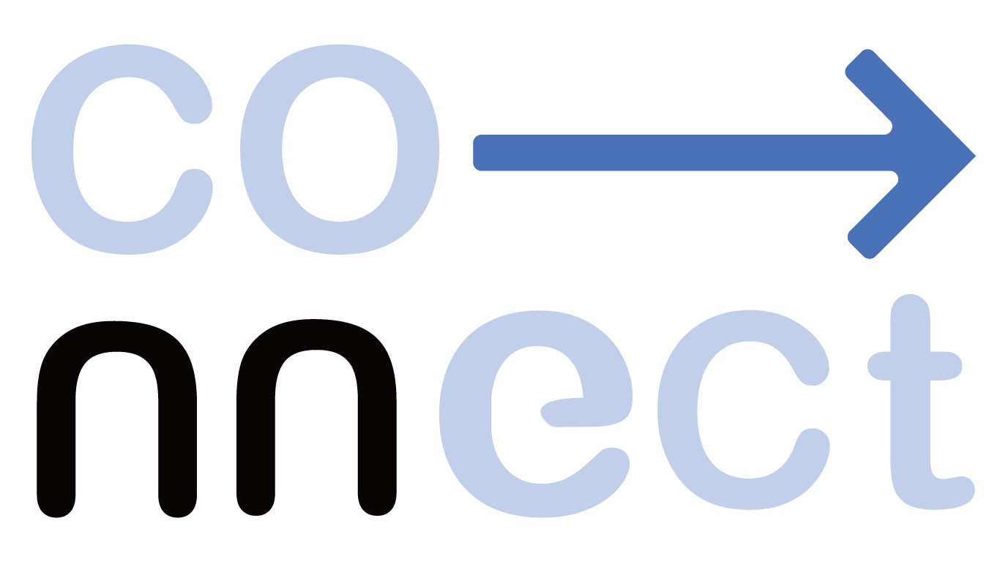

광주인공지능사관학교를 연결시키다, **connect!** 

What is connect?

connect...
<h1>광주인공지능사관학교 학생만을 위한</h1>
<h1>커뮤니티 모집 서비스</h1>

<h3>주요 기능 소개</h3>

1. 모집, 게시판

2. 그룹웨어

3. 실시간 소통 

<h3>기술 스택 (Technique Used)</h3>
   

express figma notion jquery 

<h3>사용한 패키지 (Library Used)</h3>

<ul>
  <li>@toast-ui/editor</li>
  <li>body-parser</li>
  <li>chokidar</li>
  <li>cors</li>
  <li>express</li>
  <li>express-session</li>
  <li>markdown-it</li>
  <li>marked</li>
  <li>mysql2</li>
  <li>nodemon</li>
  <li>nunjucks</li>
  <li>session-file-store</li>
  <li>socket.io</li>
  <li>socket.io-client</li>
</ul>

<h3>팀정보</h3>

이치연
김영재
박홍선
이의현
최진우

